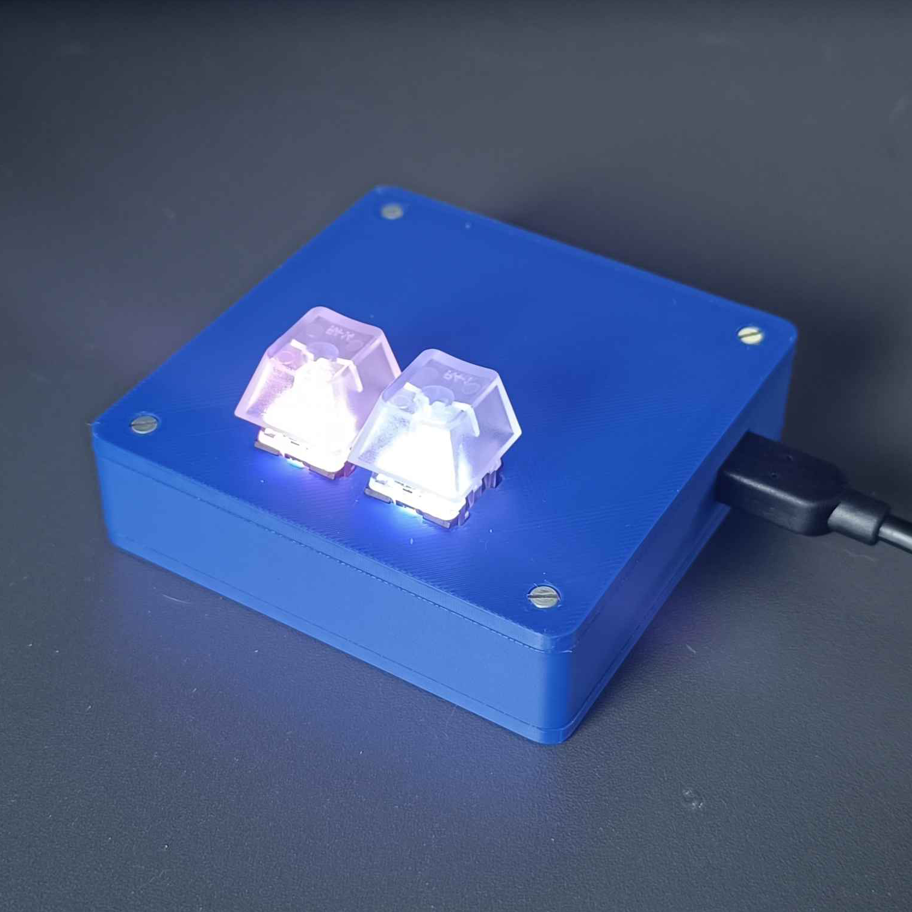

<a id="readme-top"></a>
[![CC BY-NC 4.0][cc-by-nc-shield]][cc-by-nc]
<br />
<div align="center">
 
 <h3 align="center">osu! keypad</h3>

 <p align="center">
 So you want Osu! Keypad right? Here's how I did it
 </p>
</div>

### A little word as a start
For quite some time I was developing this keypad, after finally completing this project I would like to show how I did it to the community so everyone can have a custom and fully functional Osu keypad.

***

<br />
<br />

## Keypad functions:
* USB Plug n Play
* Hot Swap
* Fully customizable RGB
* Low part cost

## What you'll need:
**Circuit Parts:**

* Raspberry Pi Pico *(I used Pico W without pre-soldered headers)* [[Buy Here]](https://www.adafruit.com/product/5526)
* Adafruit NeoKey FeatherWing [[Buy Here]](https://www.adafruit.com/product/4979)
* 2x MX-compatible switches *(any profile [low/standard] of your choice should do)* I used those [Kailh Mechanical Key Switch - Clicky Blue](https://www.adafruit.com/product/5123)
* 2x Keycaps for your switches, I used those [Translucent Keycaps for MX Compatible Switches](https://www.adafruit.com/product/4956)
* 3x 1.2k Ohm resistors [[Buy Here]](https://www.amazon.com/Projects-100EP5141K20-1-2k-Resistors-Pack/dp/B0185FI288/ref=sr_1_4?crid=M4HJDTNG3NHX&dib=eyJ2IjoiMSJ9.8579HKPXMqRA1DAOBaHlyPbVRbLClGVMCd6hA1LAZjp5gqz4xfWDhIEyZkYWrWCIGtxxetFZ7mz0Bq2c-P2Fsym7V90UqzkhDBKjh2E9GqCDdxG3TYxh-u_zbOn4YTFIsTmEt_nIPcIGVwKuvxwa1-fRmP7PWZioVRdD5WYtcHzHzrjAYgYL6Vx0iCfkEevFXDAEomxV_TW7SpoM1bXQMKIzqBwPsxdkHbDpkkuRuA4.-UhLhE09HzmyxYi1S2ySUqDzoUdntcEMfkhz5weKGl4&dib_tag=se&keywords=1.2k%2Bohm%2Bresistor&qid=1720859590&sprefix=1.2k%2Bohm%2B%2Caps%2C187&sr=8-4&th=1)
* & Some cables to connect everything

**Tools:**

* Any soldering tool
* Super Glue
* 3d printer to print case (i used [BambuLab A1 Mini](https://bambulab.com/en-us/a1-mini)) or woodwork tool if you don't have a 3d printer

**Other stuff:**

* Screwdriver
* 4x M2,5x21mm screws
* 6x M2,5x10mm screws
* 4x Hex Nuts do M2,5 screws
* Heat shrink tube

> [!NOTE]
> If you want to have full advantage of screw/nut hiding spots in case make sure that:
> * Screw head has a height of 1,5mm
> * Nut also has a height of 1,5mm
> * Distance between parallel walls of the nut is not bigger than 5mm

## Build Tutorial

Let's jump into the tutorial, here I will show you how to build a keypad. The whole build should not take you more than one day. **GOOD LUCK!**

### 1. Circuit
The circuit for this project is straightforward


**Connections Explanation:**
`GPIO 0` - RGB

`GPIO 10 / GPIO 11` - Key A / Key B
Each of those pins also has **1.2k Ohm Resistor** soldered inside & protected with a heat shrink tube.

For Pico pinout I suggest using this website: https://picow.pinout.xyz/

With connecting cables to FeatherWing things get a little confusing as they have their way of naming pins:

`D9` - RGB
`D5 / D6` - - Key A / Key B

The full pinout can be found on their GitHub repo: [Adafruit Feather nRF52840 pinout.pdf](https://github.com/adafruit/Adafruit-nRF52-Bluefruit-Feather-PCB/blob/master/Adafruit%20Feather%20nRF52840%20pinout.pdf) I used nRF52840 as a reference couse FeatherWing is created as a HAT for Adafruit microcontrollers. Make sure to connect everything as I described

### 2. Program

Before actually programming it we need to install **CircuitPython** on our pico.

To do that follow these steps:
* [Download latest version](https://circuitpython.org/board/raspberry_pi_pico_w/) of CircuitPyhton for Pico W *(or normal pico if you don't have pico W)*
* Connect Pico via USB to your computer
* Put `.uf2` file inside the folder and hold **BOOTSEL** button on the pico
* When Pico restarts you should see some new files and folders inside it

After that, we need to install the needed libs to pico to make sure everything will work, copy contents of **/code** directory of this repo to pico. This includes libs and keypad code:
```py
import time
import board
from digitalio import DigitalInOut, Pull
from adafruit_debouncer import Debouncer
import usb_hid
from adafruit_hid.keyboard import Keyboard
from adafruit_hid.keyboard_layout_us import KeyboardLayoutUS
from adafruit_hid.keycode import Keycode
import neopixel

time.sleep(1)

switch_a_output = Keycode.Z
switch_b_output = Keycode.X

#  Keyboard
keyboard = Keyboard(usb_hid.devices)
keyboard_layout = KeyboardLayoutUS(keyboard)

# Key setup
switch_a_in = DigitalInOut(board.GP10)
switch_b_in = DigitalInOut(board.GP11)
switch_a_in.pull = Pull.UP
switch_b_in.pull = Pull.UP
switch_a = Debouncer(switch_a_in)
switch_b = Debouncer(switch_b_in)

# NeoPixel setup
WHITE = 0xCCCCCC
BLACK = 0x000000
ONE = 0xEC4899
TWO = 0x8B5CF6

pixel_pin = board.GP0
pixels = neopixel.NeoPixel(pixel_pin, 2, brightness=1.0)
pixels.fill(BLACK)
time.sleep(0.3)
pixels.fill(WHITE)
time.sleep(0.3)
pixels.fill(BLACK)
time.sleep(0.3)
pixels[0] = ONE
pixels[1] = TWO

last_position = encoder.position

while True:
 switch_a.update()
 switch_b.update()

    if switch_a.fell:
 keyboard.press(switch_a_output)
    if switch_a.rose:
 keyboard.release(switch_a_output)

    if switch_b.fell:
 keyboard.press(switch_b_output)
    if switch_b.rose:
 keyboard.release(switch_b_output)
```
### 3. Program customization

**Keys:**
Keys can be customized using `switch_a_output` and `switch_b_output` vars, for example:
```py
switch_a_output = Keycode.A
switch_b_output = Keycode.B
```
For more keycodes go here: https://docs.circuitpython.org/projects/hid/en/latest/api.html#adafruit-hid-keycode-keycode

**RGB**
Use a color picker or similar tool to get the hex color code and use the example below to change it
```py
ONE = 0x<hexColor>
TWO = 0x<hexColor>
```

### 4. Case
Go to `/stl` directory inside the repo to get all of the files needed to print all of the keypad case parts, for case parts I used **0.4mm nozzle** but for both mounting solutions I used **0.2mm nozzle**

#### Mounting parts to the case
**FeatherWing:**


Print out `mounting-solution.stl` two times. Using distances and shorter screws screw a long part with holes to FeatherWing so it can be glued to the case top. To make sure everything will fit follow these steps:
* Screw mounting solution as explained before
* Put mechanical switches in keypad case holes
* Apply glue on the long part with holes
* Push FeatherWing and mechanical switches together

**Pico:**


Those elements are created to lock Pico in place so the USB Cable can be plugged in safely.

**1 and 2** are used to lock the front of the microcontroller where the micro USB port is, **2** should be glued to the case, **1** works as a cap for the **2** since I didn't have M2 screws which are needed for the pico

**3 and 4** are used to lock back of the pico, put **3** on the top and **4** on the bottom then use shorter screw to lock it

After that, we need to glue it to the case, before you apply the glue put a USB cable through the hole in the case wall and plug it into the pico. This will prevent the situation where we can't plug the cable into the pico after the procedure.

Apply the glue and put pico in place, if you did everything perfectly it should look like this:


## Afterword
I know that this guide is a mess so if you encounter any problems add me on Discord: `kamehame_ha`
If you liked this project leave a star, I'd appreciate that

### License

This work is licensed under a
[Creative Commons Attribution-NonCommercial 4.0 International License][cc-by-nc].

[![CC BY-NC 4.0][cc-by-nc-image]][cc-by-nc]

[cc-by-nc]: https://creativecommons.org/licenses/by-nc/4.0/
[cc-by-nc-image]: https://licensebuttons.net/l/by-nc/4.0/88x31.png
[cc-by-nc-shield]: https://img.shields.io/badge/License-CC%20BY--NC%204.0-lightgrey.svg
